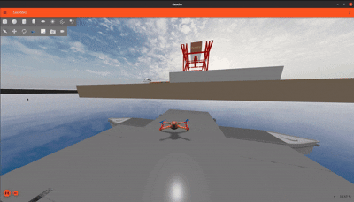

# LLM-VLM Fusion: Intelligent Maritius Systems

## 🌊 Overview

The **LLM-VLM Fusion** project is an advanced autonomous maritime system that integrates Large Language Models (LLM) and Vision-Language Models (VLM) for intelligent control and coordination of heterogeneous USV-UAV operations. This system combines natural language understanding, computer vision, and autonomous navigation to enable sophisticated maritime missions including surveillance, inspection, and survey operations.

## �️ Core Capabilities

<div align="center">
<table>
<tr>
<td align="center" width="50%">

### 🧭 Mapping & SLAM


**Real-time Maritime SLAM**
- Simultaneous Localization and Mapping
- Obstacle detection and avoidance


</td>
<td align="center" width="50%">

### 🚢 USV Navigation


**Autonomous Navigation System**
- Waypoint following and trajectory tracking
- Real-time obstacle avoidance

</td>
</tr>
<tr>
<td align="center" colspan="2">

### 🚁 UAV Coordination


**Autonomous UAV Operations** *(12x speed)*
- 3D flight control and mission execution
- Heterogeneous USV-UAV coordination

</td>
</tr>
<tr>
<td align="center" width="50%">

### 🛫 UAV Takeoff


**Autonomous Takeoff Operations**
- Vertical takeoff capabilities
- Flight initialization and stabilization

</td>
<td align="center" width="50%">

### 🛬 UAV Landing


**Autonomous Landing Operations**
- Precision landing capabilities
- USV deck landing coordination

</td>
</tr>
</table>
</div>


## System Integration

### Communication Architecture
```
┌─────────────────┐    ┌─────────────────┐
│   LLM Mission   │◄──►│   GPT-4 API     │
│    Planner      │    │   Integration   │
└─────────┬───────┘    └─────────────────┘
          │
          ▼
┌─────────────────┐    ┌─────────────────┐    ┌─────────────────┐
│   USV Control   │◄──►│   UAV Control   │◄──►│  VLM Inspection │
│   & Navigation  │    │   & Navigation  │    │    Module      │
└─────────────────┘    └─────────────────┘    └─────────┬───────┘
          │                       │                      │
          ▼                       ▼                      ▼
┌─────────────────┐    ┌─────────────────┐    ┌─────────────────┐
│  USV Camera     │    │  UAV Camera     │    │ Florence, Quen2VL│
│  /usv/slot0/    │    │ /quadrotor_1/   │    │   SmolVLM, etc  │
│   image_raw     │    │ slot0/image_raw │    │   VLM Models    │
└─────────────────┘    └─────────────────┘    └─────────────────┘
```
## 📁 Project Structure

This project implements a comprehensive autonomous maritime platform featuring:

- **🗺️ USV SLAM & Navigation** (`nav2/`): Advanced SLAM and autonomous navigation system for maritime operations with real-time mapping, obstacle avoidance, and ROS2 Nav2 integration
- **🎮 USV Control & Guidance** (`nav_packages/`): Low-level control systems featuring PID motion control, dynamic positioning, thrust allocation, and maritime dynamics modeling
- **� UAV Control & Guidance** (`uav_navigation/`): Comprehensive UAV flight control with mission execution, inspection patterns, survey operations, and USV deck landing capabilities
- **�️ Vision-Language Model Inspection** (`vlm_inspection/`): Multi-model VLM system (Florence, Quen2VL, SmolVLM) for real-time camera feed analysis, object detection, and automated inspection reports
- **🤖 LLM-based Mission Planning** (`unified_mission_planner/`): Intelligent mission planning system using GPT-4 for natural language mission interpretation and heterogeneous USV-UAV coordination with symbolic planning, dependency management, and coordinated execution

## �️ System Requirements

- **Ubuntu 20.04**
- **ROS Galactic**
- **PyTorch**

### Installing Simulator
To run the code, we first need to install the MBZIRC simulator. The below link contains detailed instructions to install the simulator:

**MBZIRC Simulator**: https://github.com/osrf/mbzirc

## �🛠️ Installation & Setup

### Prerequisites
- **ROS2 Galactic** or newer
- **Python 3.8+**
- **OpenAI API key** (for LLM integration)
- **Ignition Gazebo** (for simulation)

### Build Instructions
```bash
# Navigate to workspace
cd /path/to/your/workspace

# Install dependencies
rosdep install --from-paths src --ignore-src -r -y

# Build the packages
colcon build --packages-select nav2 nav_packages uav_navigation unified_mission_planner vlm_inspection

# Source the workspace
source install/setup.bash
```

## 🚀 Quick Start

### 1. Launch Maritime Simulation Environment
```bash
# Start the maritime simulation with coast-port environment
ros2 launch mbzirc_ros competition_local.launch.py ign_args:="-v 4 -r coast-port.sdf"
```

### 2. Spawn USV and UAV with Sensors
```bash
# Spawn USV with LiDAR and RGBD camera
ros2 launch mbzirc_ign spawn.launch.py name:=usv world:=coast model:=usv x:=-1450 y:=-16.5 z:=0.3 R:=0 P:=0 Y:=0 slot0:=mbzirc_planar_lidar slot1:=mbzirc_rgbd_camera

# Spawn UAV (quadrotor) with HD camera
ros2 launch mbzirc_ign spawn.launch.py name:=quadrotor_1 world:=coast model:=mbzirc_quadrotor x:=-1450 y:=-16.5 z:=4.3 R:=0 P:=0 Y:=0 slot0:=mbzirc_hd_camera
```

### 3. Launch USV Systems
```bash
# Launch USV description and transforms
ros2 launch usv_description usv.launch.py

# Start mapping system
ros2 launch ros2_mapping map_bringsup.launch.py

# Start USV odometry publisher
python3 ~/mbzirc_ws/src/nav_packages/navigation/navigation/usv_odometry_publisher.py
```

### 4. Launch UAV Systems
```bash
# Start UAV transform publisher
ros2 run uav_llm_mission_planner uav_tf_publisher 

# Start UAV mission executor
ros2 run uav_llm_mission_planner uav_mission_executor 
```

### 5. Launch USV Control Systems
```bash
# Set Python path for USV control
export PYTHONPATH=$PYTHONPATH:~/mbzirc_ws/src/nav_packages/usv_control/src

# Start USV twist publisher
ros2 run usv_control twist_publisher 

# Start USV navigator
python3 ~/mbzirc_ws/src/nav_packages/navigation/navigation/navigator.py
```

### 6. Start Intelligent Mission Planner
```bash
# Launch LLM-based heterogeneous mission planner
ros2 launch unified_mission_planner heterogeneous_mission_system.launch.py
```

## 🔧 Configuration

### LLM Configuration
Edit `unified_mission_planner/config/openai_key.json`:
```json
{
    "key": "your-openai-api-key-here"
}
```

### Mission Prompts
Customize mission planning in `unified_mission_planner/config/heterogeneous_prompt.txt`

### Navigation Parameters
- USV parameters: `nav_packages/config/usv_navigation_params.yaml`
- UAV parameters: `uav_navigation/config/uav_mission_params.yaml`


### Topic Interface
- **Mission Commands**: `/uav_mission_command`, `/target_vessel_pose`
- **Status Feedback**: `/uav_mission_step_complete`, `/reach_subgoal`
- **Coordination**: `/unified_mission_plan`, `/mission_status`
- **Camera Feeds**: `/usv/slot0/image_raw`, `/quadrotor_1/slot0/image_raw`
- **VLM Analysis**: `/vlm_inspection_results`, `/vlm_detection_annotations`


## 🙏 Acknowledgments

- **ROS2 Community** for the navigation framework
- **OpenAI** for GPT-4 integration capabilities
- **Ignition Gazebo** for simulation environment
- **Maritime Research Community** for domain expertise

